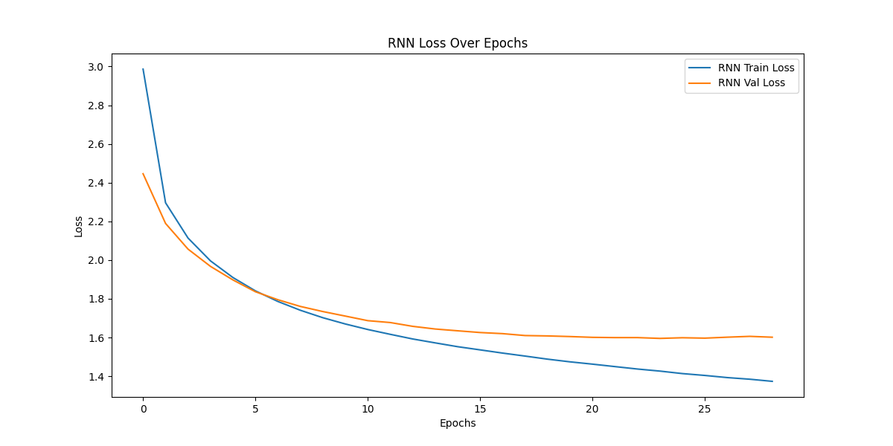

# Character-Level Language Modeling
Shakespeare 데이터셋을 활용한 문자 기반의 Neural Network modeling
## Models
### hyper parameters
RNN과 LSTM은 둘 다 동일한 hyper parameter로 학습하였습니다.
- batch_size = 64
- seq_length = 30
- epochs = 50
- learning_rate = 0.001
- patience = 5
- vocab_size = len(dataset.chars)
- hidden_size = 256
- n_layers = 2
모델 학습 중에 성능이 개선되지 않으면 학습이 중단되도록 early_stopping을 설정하였습니다.

#### 과적합
처음에는 hidden_size=512, learning_rate=0.002였으나 과적합이 발생하여 이를 해결하기 위해 아래와 같이 값을 조정하였습니다. 그 결과 validation loss가 감소하였고, 변경한 상태로 최종 학습을 진행하였습니다.
- hidden_size = 256
- learning_rate = 0.001

### Performance
#### RNN loss plot

#### LSTM loss plot

RNN: early_stopping이 적용되어 28번째 epoch 에서 학습을 중단했습니다.  
LSTM: early_stopping이 적용되어 30번째 epoch 에서 학습을 중단했습니다.  
두 모델 모두 학습이 거듭될 수록 train보다 validation loss 값이 높아지는 현상을 확인할 수 있습니다.  
Epoch 7/50, RNN Train Loss: 1.7861, RNN Val Loss: 1.7950  
Epoch 10/50, LSTM Train Loss: 1.8358, LSTM Val Loss: 1.8378  
이는 train 데이터의 양이 vadliation 데이터 양보다 많으므로 어느 정도 과적합되어 발생하는 것으로 판단됩니다.  
하지만 RNN과 LSTM 두 모델의 train loss, validation loss 값은 전반적으로 우하향 추세를 보이고 있으므로 학습이 잘 되었다고 볼 수 있습니다.  
  
RNN보다 LSTM의 성능이 더 좋은 것을 확인할 수 있습니다.  
아래는 RNN과 LSTM의 마지막 epoch에서의 loss 값입니다.  

|               |CharRNN(28)|CharLSTM(30)|
|---------------|------|-----|
| Cross Entropy Loss(Train)|1.3844|1.3188|
| Cross Entropy Loss(Valid)|1.6059|1.6002|

### 

## Generate samples
### 5. Write generate.py to generate characters with your trained model. Choose the model showing the best validation performance. You should provide at least 100 length of 5 different samples generated from different seed characters.
- seed_chars_list = ['A', 'a', 'B', 'b', 'C']
- temperatues = 0.5

위와 같이 설정하고 best model인 LSTM을 사용하여 sample을 생성하였습니다.  
seed character를 [A, a, B, b, C] 이렇게 a와 b에 대해 각각 대문자와 소문자를 모두 넣은 것은 대문자와 소문자 여부에 의해 샘플이 다르게 생성될 것 같아서 이와 같이 설정하였습니다.  
아래는 생성 결과입니다.  

생성 결과를 살펴보면 같은 문자여도 대문자/소문자 여부에 따라 생성되는 텍스트의 유형이 다른 것을 확인할 수 있습니다.  
대문자의 경우 등장인물의 이름이, 소문자의 경우 일반적인 서술 지문이 생성됩니다.  
이는 원본 데이터셋인 Shakespeare 데이터셋이 셰익스피어의 희곡이므로 원본의 형식에 따라 텍스트가 생성되는 것으로 판단됩니다.  
  

### 6. (Report) Softmax function with a temperature parameter *T* can be written as: 
$$y_i = \frac{\exp(z_i/T)}{\displaystyle\sum \exp(z_i/T)}$$
Try different temperatures when you generate characters, and discuss what difference the temperature makes and why it helps to generate more plausible results.
  
- temperatures = [0.2, 0.5, 1.0, 2.0, 5.0, 10.0]

